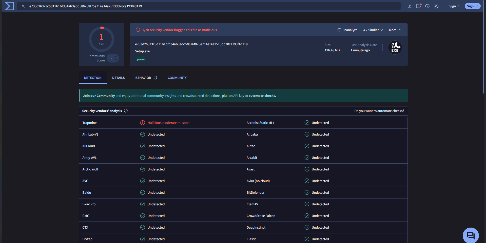

# HyperZHub
**HyperZHub** is a hub that brings together some of our **HyperZTeam Products** in one sleek, unified interface.
---
## Also read LICSENSE and Don't report these bugs
1. [LICENSE](LICENSE.md)
2. [Don't report these bugs](Don't%20report%20these%20bugs.md)
---

## What is HyperZHub?

HyperZHub is a single-page web app that hosts tools side by side under one roof:

- **HyperZChat** — a chat application powered by [hyperzteam456](https://hyperzteam456.github.io/hyperzchat)
- **HyperZWeb** — a web browsing tool powered by [hyperzteam456](https://hyperzteam456.github.io/hyperzweb)
- **HyperZOS** - a HTML based OS simulator powered by [hyperzteam555](https://hyperzteam555.github.io/hyperzos)
- **UBGames** - a Unblocked Games site framed in HyperZHub [OnlyGames](https://only-game.github.io/#all)

Switch between them instantly using the top navigation bar — no reloading, no new tabs.

---

## Features

- **Unified Hub** — Our products in one place, accessible via a clean topbar
- **Launch Options** — Choose how you want to open HyperZHub:
  - `about:blank` — Opens the hub in a clean blank tab for a stealth browsing experience
  - `Blob Tab` — Opens via a temporary blob URL, leaving no trace in the address bar
- **Auto-close** — The original tab closes itself after launching, keeping your browser tidy
- **HyperZHub Watermark** — Branded top-left watermark so you always know where you are
- **Proxy** — Proxies itself for some privacy so your IP isn't always showing

---

## How to Use

1. Open `hyperzteam456.github.io/hyperzhub` in your browser
2. Select a **launch option** — either `about:blank`, `Blob Tab`, or `Data URL`
3. HyperZHub opens in a new tab and the original tab closes
4. Use the **Chat**, **Web**, **OS**, and **UBApps** buttons in the topbar to switch between the products!

---

## Virustotal image

We also encourage you to scan at **[Virustotal.com](virustotal.com)** if you don't believe we don't have malware.

Q: What does Malicious.moderate.ml.score mean?

A: It simply that its basically saying that it looks similar to malware we've seen before however it doesn't mean its malware and commonly a false positive for new applications that are unrecognized.

---

## Credits

Built by the HyperZTeam.

---

## Links

[HyperZHub Links](https://docs.google.com/presentation/d/1vt9dVx-aIfOVbBpmp_G-rjXi_JXYHhnbti5D450IAEY/present)
